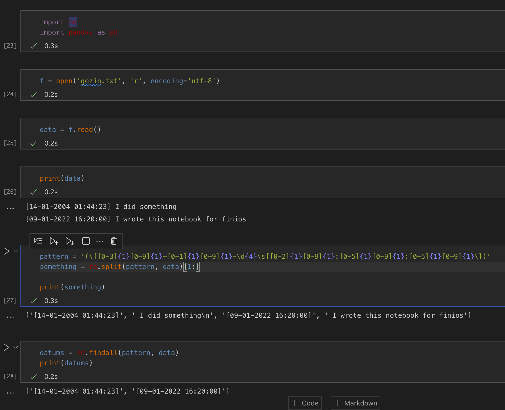

# Stack Overflow Question 70643023 - Answer Code Example

A Python Jupyter notebook to replicate the issue Finios was having with some regex on Stack Overflow: [https://stackoverflow.com/questions/70643023/how-to-write-the-regex-code-for-the-datetime-exported-from-my-whatsapp-messages/70643180#70643180](https://stackoverflow.com/questions/70643023/how-to-write-the-regex-code-for-the-datetime-exported-from-my-whatsapp-messages/70643180#70643180)

This repository uses pipenv to manage dependancies and was tested using Python 3.9.

Example of notebook output:
